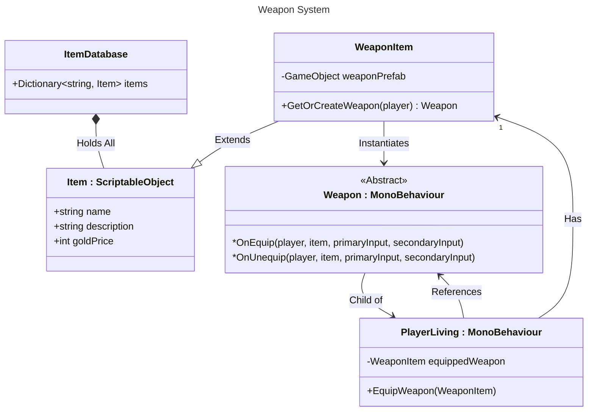

```mermaid
---
title: Weapon System
---
classDiagram
    direction TB
    class ItemDatabase {
        +Dictionary~string, Item~ items 
    }
    ItemDatabase *-- Item: Holds All
    class Item["Item : ScriptableObject"] {
        +string name
        +string description
        +int goldPrice
    }
    WeaponItem --|> Item: Extends
    class WeaponItem {
        -GameObject weaponPrefab
        +GetOrCreateWeapon(player) Weapon
    }
    WeaponItem --> Weapon: Instantiates
    class Weapon["Weapon : MonoBehaviour"] {
        <<Abstract>>
        *OnEquip(player, item, primaryInput, secondaryInput)
        *OnUnequip(player, item, primaryInput, secondaryInput)
    }
    Weapon --> PlayerLiving: Child of
    PlayerLiving --> Weapon: References
    WeaponItem "1" <-- PlayerLiving: Has
    class PlayerLiving["PlayerLiving : MonoBehaviour"] {
        -WeaponItem equippedWeapon
        +EquipWeapon(WeaponItem)
    }
```

